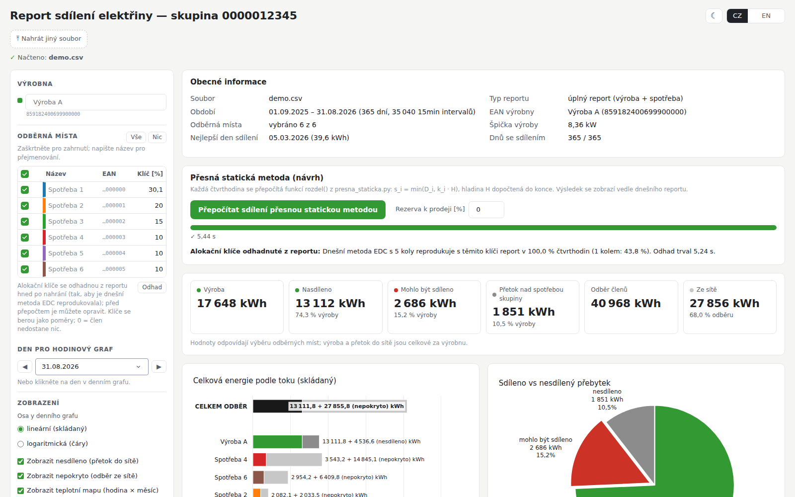
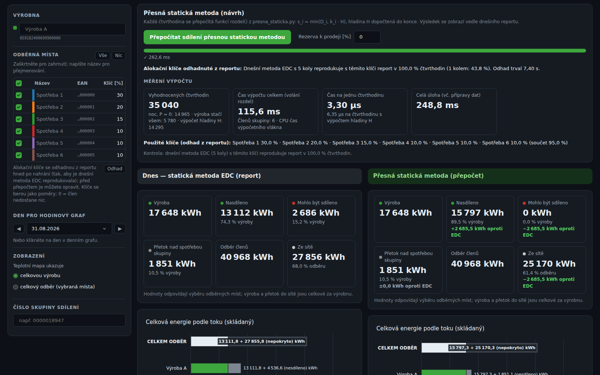
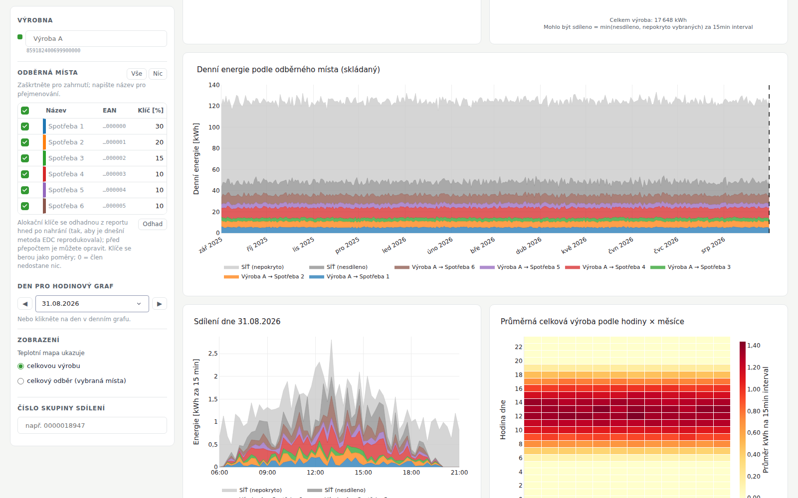

# EDC sharing report

Interactive web app (Dash) that displays the electricity-sharing data of a Czech sharing
group. The input is the CSV report generated on [edc-cr.cz](https://www.edc-cr.cz), the portal
of the *Elektroenergetické datové centrum* (EDC). Upload the CSV and you get the group's
sharing at a glance. The app also recomputes the whole period with the proposed **exact
static method** (`presna_staticka.py`) and shows today's result and the proposal side by side,
with the computation timed per 15-min interval.

> **Česky:** Webová aplikace, která zobrazuje data o sdílení elektřiny z CSV reportu
> vygenerovaného na portálu edc-cr.cz. Po nahrání CSV ukáže
> souhrny, denní a hodinové grafy, teplotní mapu a podíl, který „mohl být sdílen“.
> Z reportu odhadne alokační klíče (dnešní metoda EDC s 1 nebo 5 koly, i pro velké skupiny).
> Jedním tlačítkem přepočítá sdílení přesnou statickou metodou a porovná ji s dneškem.
> Rozhraní je v češtině i angličtině, se světlým i tmavým režimem.



## Contents

- [Features](#features)
- [Quick start](#quick-start)
- [Using the app](#using-the-app)
- [How the allocation keys are estimated](#how-the-allocation-keys-are-estimated)
- [Exact static method and timing](#exact-static-method-and-timing)
- [Architecture](#architecture)
- [Performance](#performance)
- [Deployment on Render](#deployment-on-render)
- [Configuration](#configuration)
- [Tests](#tests)
- [Limitations](#limitations)
- [Data and privacy](#data-and-privacy)

## Features

**Report of today's sharing** (the figures of `plot_energy_sharing.py`, interactive):

* **General information and headline figures:**
  * facts: period, 15-min intervals, producer, peak production, best day;
  * energy: production, shared, *could have been shared*, surplus above group demand;
  * consumption: members' consumption and energy from the grid.
* **Total energy by flow:** stacked bars per member (shared | unmet) and for the source
  (shared | shared to unticked members | unshared).
* **Pie "where the production went":** shared to the ticked members, shared to the unticked
  ones (hatched), *could have been shared* (min(unshared, unmet of the ticked members) in the
  same 15 min), and surplus nobody could use. The slices always add up to the production,
  whatever is ticked.
* **Daily energy:** stacked areas (linear axis) with the grid flows, unshared and unmet, and
  the hatched energy that went to unticked members. **Click a day** to select it.
* **Sharing on the selected day:** 15-min steps from 06:00 to 21:00, always directly under the
  daily plot. The y axis is fixed over the whole period, so days compare on one scale.
* **Heatmap hour × month:** the **total production** (independent of the selection) or the
  **total consumption** of the ticked members. A part report has neither, so it shows the
  shared energy.
* **Per-member table:** consumption, shared, unmet, coverage and data availability.

**Selection panel:**

* Tick members on or off, rename them, and edit their allocation keys. All of this happens in
  one grid, so a group of hundreds of members stays fast.
* ◀ date ▶ for the hourly plot.
* Heatmap metric (production / consumption).
* Group ID for the title.

**Exact static method (proposal):**

* **Keys:** estimated from the report right after upload. You can check and correct them
  before the recompute.
* **Recompute:** one button runs `rozdel()` for every 15-min interval, with a progress bar.
* **Side by side:** today (EDC) and the exact method, with shared axes, differences to EDC in
  the tiles, and a per-member comparison table.
* **Sharing error:** when the recompute is done, a callout gives the error of today's EDC
  algorithm as a percentage of the maximum sharing (what the exact method shares), with the
  kWh missed.
* **Timing:** the number of intervals evaluated, total time, and time per interval, split by
  the method's fast paths.

**Interface:**

* CZ / EN.
* Light and dark mode: the default follows the system, and the ☾/☀ icon switches and
  remembers the choice.
* Works on a phone.



## Quick start

```bash
git clone https://github.com/ottapav/edc-report.git && cd edc-report
python -m venv .venv && . .venv/bin/activate   # Python 3.11 (see .python-version)
pip install -r requirements.txt
python app.py                                  # http://127.0.0.1:8050
```

To run it exactly as in production:

```bash
gunicorn app:server -c gunicorn.conf.py        # listens on $PORT (default 8050)
```

## Using the app

1. **Upload** the CSV report generated on edc-cr.cz (file name like
   `Export-dat-…-report-….csv`). Both report layouts are detected from the header:
   * **all report** (`IN/OUT-<ean>-D` for the producer, `IN/OUT-<ean>-O` for members) carries
     production and consumption and enables everything;
   * **part report** (`<ean>-<ean>` columns) has shared energy only: no pie, no recompute.
2. The report appears immediately, and the **allocation keys are estimated in the
   background**. A summary shows which EDC method explains the report (1 or 5 rounds) and
   how many 15-min intervals it reproduces. Keys that the report cannot pin down exactly are
   marked, and hovering shows the range of equally consistent values.
3. **Check the keys** against the contract and correct them in the grid if needed; **Odhad**
   restores the estimate. Keys act as ratios in the exact method, and 0 means the member gets
   nothing. An optional *reserve for sale* is passed to `rozdel(..., rezerva=)`.
4. **Recompute.** The second column appears next to today's report, and the timing card shows
   the computation.
5. **Explore:**
   * click a day in either daily plot, or use ◀ ▶, to see it in 15-min steps;
   * untick members to see the rest of the group;
   * switch the heatmap between total production and total consumption.



## How the allocation keys are estimated

The CSV has no keys, but it contains what today's EDC static method did with them. In every
round each member gets `min(remaining demand, floor(k_i · P_r))`, where `P_r` is the production
left at the start of the round. Groups up to 100 EAN get 5 rounds, larger groups one round.
`keyfit.py` inverts this. The result is a **rough estimate**: it need not be optimal, but it
must never contradict the report.

**Rules that always hold**

* A member that never receives anything while it has demand and there is production gets
  **key 0**. The report only bounds its key from above, and a nonzero key would contradict it.
  A member without any demand while there was production also gets 0 (no phantom key).
* A member that is always fully covered gets the smallest key that keeps it covered.
* The keys never sum above 100 %, and the match with the report (the share of 15-min intervals
  that today's method reproduces with these keys) is always measured on **every** interval.

**How it works**

* **Every interval where a member is not fully covered bounds its key.** Such a member was
  never capped, so it received exactly `floor(k_i · P_r)` in each round:
  `sum_r floor(k_i · P_r) = s_i`. That pins `k_i` to a small interval, found exactly by
  bisection. An interval where the member is fully covered gives a lower bound.
* **The key is the value consistent with the most intervals**, on the 0.01 % grid of EDC
  keys. A rounder value nearby (1 %, 0.5 %, …) wins only when the separating intervals do not
  clearly favour the finer one. This absorbs the ~1 % of report rows that do not follow the
  model, without inventing round numbers.
* **One round is separable**, because each member depends only on its own key, so all keys
  come out in one pass over every interval. This covers the groups above 100 EAN.
* **Five rounds couple the members** through `P_r`. The bounds are iterated to a (nearly) fixed
  point from a rank-1 estimate, which needs no `P_r`, because two members short in the same
  interval both got their key's share of the same productions. The fit is then settled by
  replaying the method: moving single keys, and moving all keys together (rounded or rescaled).
  If the match is still below 98 %, a second, uniform start is tried and the better fit kept.
* **The five-round search is rough on purpose.** It works on at most 1 500 informative
  intervals, evenly spread over the period (every member keeps up to 300 of its own), with a
  few iterations and one sweep; small groups (rows × members ≤ 60 000) get the full search on
  all intervals. After 20 s (`FIT_BUDGET_S`) it returns the best keys found so far and the
  page says so. This is as good as the full search on the benchmark, in a tenth of the time.
* Both round counts are tried (5 only up to 100 members, and not when one round already
  explains the report), and the one that reproduces more intervals wins.

For every key the app also returns the **range of values the report fits equally well**. A key
is marked when that range is wider than 0.2 pp or 5 % of the key. Typical causes are a member
that is almost always fully covered (then only a lower bound is known) or one with no data.

**Accuracy and time**, measured by `python bench/keyfit_bench.py` on synthetic one-year groups
(35 040 intervals): EDC shares from known keys, 1 % of intervals perturbed, one CPU core.
"truth" is what the true keys reproduce, so a fit "as good as the truth" cannot do better.

| Members | Keys | EDC rounds | Match with the report (truth) | Keys equal to the true ones | Time |
|---|---|---|---|---|---|
| 20 | random, 0.01 % steps | 5 | 99.0 % (99.0 %) | 85 % | 2 s |
| 60 | whole percent | 5 | 99.0 % (99.0 %) | 90 % | 5 s |
| 60 | random | 5 | 99.0 % (99.0 %) | 92 % | 7 s |
| 100 | random | 5 | 99.0 % (99.0 %) | 99 % | 18 s |
| 150 | random | 1 | 99.0 % (99.0 %) | 100 % | 0.5 s |

The real group 0000018947 (5 members, 1 year) comes out as exactly 50 / 10 / 10 / 10 / 10 %,
reproducing 99.2 % of intervals, in about 3 s. Keys that differ from the true ones are
members whose value the data cannot pin down (every value in the reported range reproduces the
report equally well). The summary shows the match and warns below 95 %, so check those keys
against the contract. On the free Render instance (less than 1 CPU) expect several times
longer.

## Exact static method and timing

`presna_staticka.py` is the reference implementation (unchanged). Each member gets
`s_i = min(D_i, k_i · H)`, with the level `H` computed to the end, so everything that can be
consumed is shared while the keys hold. `recompute.py` calls `rozdel()` for every 15-min
interval of the report and builds a second report in the same structure, so every figure and
table works for both.

**Timing.** The loop runs in a forked worker process: it gets a whole core, and the web
server's threads do not disturb the measurement. It is timed with that process's CPU clock:

* the garbage collector is told to ignore the inherited server heap (`gc.freeze()`), otherwise
  copy-on-write faults were billed to `rozdel()`;
* intervals are grouped by the method's fast paths (night P = 0; production covers everyone;
  level H computed) and each group is timed as one batch, so there is no per-call timer
  overhead.

The page reports the number of evaluations, the total time, the time per interval (overall
and with H computed), and the whole job.

For the real group (5 members, 35 040 intervals), 22 333 are night, 3 727 have enough for
everyone and 8 980 need H. That takes 50–65 ms in total, about 1.5–1.9 µs per interval and
about 4.5 µs with H. For 150 members and one month it takes about 70–80 ms and 25 µs per
interval. Numbers vary with the machine; Render instances have less than one CPU.

## Architecture

| File | Role |
|---|---|
| `app.py` | Dash layout and callbacks, in-memory store, background jobs, config, `/healthz`, optional basic auth |
| `edc_data.py` | CSV parsing (both layouts), per-member frames keyed by EAN, statistics; memoised derived data |
| `keyfit.py` | Replay of today's EDC method (numpy, in blocks), rough key estimation for 1 and 5 rounds |
| `bench/keyfit_bench.py` | Reproducible accuracy / time benchmark of the key estimate (synthetic data) |
| `recompute.py` | Exact static recompute (the `rozdel()` loop in a child process), timing |
| `procjob.py` | Runs a function in a forked child with progress, cancellation and a time limit |
| `presna_staticka.py` | Reference implementation of the exact static method |
| `figures.py` | Plotly figures, light/dark themes, folding of large groups into "Others" |
| `i18n.py` | CZ/EN strings and number formatting |
| `assets/style.css` | Styles, light/dark variables (Dash loads it automatically) |
| `gunicorn.conf.py`, `render.yaml`, `.python-version` | Deployment |
| `tests/` | pytest suite (synthetic data, no real CSV needed) |

**One process on purpose.** An upload, its key estimate, a running recompute and its progress
live in the memory of one process, and every request of that browser session must reach it.
`gunicorn.conf.py` therefore pins **one worker** (ignoring `WEB_CONCURRENCY`) with threads, and
never recycles it (`max_requests = 0`).

This is the failure mode fixed in robopid-simulator: there, with two workers, the progress
polls of a job reached the worker that did not start it, and the button looked dead. More
workers here would need a shared store such as Redis, not a bigger worker count.

**Background jobs.** Key estimation (after upload) and the `rozdel()` loop of the recompute
each run in a **forked child process** (`procjob.py`), started from a job thread. The web
server's request threads therefore stay free for progress polls and page renders, the child
gets a core of its own, and its arguments (big numpy arrays) are shared with the parent by
`fork` instead of being pickled; only progress messages and the small result travel back.
At most `EDC_MAX_JOBS` jobs run at once, and the rest wait in a visible queue. The browser
polls every 200 ms, and only the poll callback draws the progress bar and the button state.
Because a job is a process, it can be **cancelled**, and the slot is freed at once:

* when the same browser uploads another file (the old report and its jobs are dropped), or
  the report is evicted from the cache;
* when the page stops polling for `EDC_JOB_IDLE_S` seconds (tab closed). A waiting job leaves
  the queue the same way;
* when a key estimate runs longer than `EDC_FIT_TIMEOUT` seconds. It stops itself after about
  20 s with the best keys so far, so this is only a safety net.

The child resets gunicorn's signal handlers, so killing it really stops it. `/healthz` shows
`jobs_running`, `jobs_queued` and `max_jobs`. Two other safeguards:

* the poll is idempotent: every later poll repeats the complete final state, because Dash may
  drop the first "done" response when the next poll overtakes it;
* a job that disappeared (server restarted, or a free instance went to sleep) is reported and
  the button re-enabled, instead of leaving the page waiting.

**Efficiency measures** (from the code review):

* One grid for all members instead of 4 inputs per member. With 600 pattern-matching
  components the Dash renderer needed tens of seconds per update for 150 members.
* Tables are rendered as one HTML block instead of thousands of React components.
* More than 10 members fold into 9 + "Others" in the plots. tab10 has 10 colours and hues
  are never cycled; the ranking comes from today's report, so both columns match. Tables keep
  every member.
* Derived data is memoised per upload and selection: filtered frames, aggregates, totals,
  daily sums, heatmap pivots, the hourly y range.
* Editing a key no longer redraws any figure; only the small "keys changed" note updates.
* The selected-day marker moves in the browser (clientside callback).
* Figures are built with one validated layout call; unused per-point hover data is gone.

## Performance

Measured in a browser against the production setup (gunicorn, one worker):

| | 5 members, 1 year | 150 members, 1 month |
|---|---|---|
| Upload → report and estimated keys | ≈ 3 s | 2.4 s (was 18 s) |
| Recompute → side-by-side report | < 1 s | 1.8 s (was 45 s) |
| Untick a member → both reports redrawn | < 0.5 s | 0.7 s (was 24 s) |
| Server render of the full page | 60–200 ms | 0.75 s |
| Memory | ≈ 95 MB + 20–25 MB per cached report | |

## Deployment on Render

The app runs on Render as the web service **edc-report** (project *edc-report*, environment
*Production*, free plan, Frankfurt). `render.yaml` is the Blueprint of that service: it is
based on Render's export of the live service, plus the settings the app relies on.

| Setting | Value |
|---|---|
| Build | `pip install -r requirements.txt` (Python 3.11 from `.python-version`) |
| Start | `gunicorn app:server -c gunicorn.conf.py` |
| Health check | `/healthz` |
| Auto-deploy | every commit to `main` |
| Environment | `EDC_CACHE_MAX=6`, `EDC_MAX_UPLOAD_MB=25`, `EDC_MAX_JOBS=2`; optionally `BASIC_AUTH_USER` and `BASIC_AUTH_PASSWORD` |

To set it up from scratch, use Render → **New → Blueprint** → this repository → **Apply**.

Notes:

* **Existing service:** the live service was created in the dashboard with the start command
  `gunicorn app:app`. That works too: Dash 4 is a WSGI app, and gunicorn loads
  `gunicorn.conf.py` from the repository root on its own. Changes to `render.yaml` reach a
  service only when it is managed by a Blueprint; otherwise set the health check and the
  environment variables in the service settings.

* **Free plan:** 512 MB, and it sleeps after 15 minutes without traffic. The first visit then
  waits about a minute, and uploaded reports are gone; the page says so and asks for the file
  again. The *0.5c-512mb* plan ($7/month) stays up.
* **Memory:** both plans have 512 MB. Keep `EDC_CACHE_MAX` about 6.
* **Keep one worker.** Do not add `--workers N`, and do not rely on `WEB_CONCURRENCY` (see
  *Architecture*).

## Configuration

| Variable | Default | Meaning |
|---|---|---|
| `PORT` | 8050 (Render sets it) | port for gunicorn |
| `EDC_THREADS` | 8 | request threads of the single worker |
| `EDC_MAX_JOBS` | 2 | key estimations / recomputes running at once (others queue); set to the number of CPUs of the instance |
| `EDC_FIT_TIMEOUT` | 120 | seconds after which a key estimate is killed |
| `EDC_JOB_IDLE_S` | 180 | seconds without a progress poll after which a job is cancelled (page closed) |
| `EDC_CACHE_MAX` | 6 | uploaded reports kept in memory (oldest dropped) |
| `EDC_MAX_UPLOAD_MB` | 25 | largest accepted CSV |
| `BASIC_AUTH_USER`, `BASIC_AUTH_PASSWORD` | empty | password-protect the whole app when both are set |
| `LOG_LEVEL` | info | gunicorn log level |

## Tests

```bash
pip install pytest
python -m pytest -q tests
```

The suite runs on synthetic groups and a synthetic *all report* CSV, so no real meter data is
needed. It checks that:

* the vectorised replay equals `staticka_edc`;
* the exact per-interval key bounds contain the true key;
* keys are recovered, or fit as well as the truth with the truth inside the reported range,
  for 5 rounds and for a 150-member 1-round group;
* the CSV round-trips through the parser;
* the exact method adds exactly the "could have been shared" energy;
* the timing counts every interval;
* memoisation reuses frames.

## Limitations

* **Several producers:** all reports with more than one producer are not supported yet (the
  part report is). The exact method for several producers would use the pool mode (`bazen()`).
* **Keys:** the estimate cannot be better than the report allows. Members that are almost
  always fully covered only get a lower bound. Irregular keys in large 5-round groups may stop
  at a local optimum. The match and the ranges are always shown.
* **Windows:** there is no `fork`, so the `rozdel()` loop runs in the server process and its
  timing can be higher. Linux (Render) and macOS are fine.
* **Date picker:** month names follow the browser, not the CZ/EN switch.

## Data and privacy

Uploaded files are parsed in memory only and never written to disk. They disappear when the
cache drops them or the server restarts. `.gitignore` excludes `*.csv`, so real meter data
does not end up in the repository. The screenshots above use a synthetic group. For a public
deployment, set the basic-auth variables.
